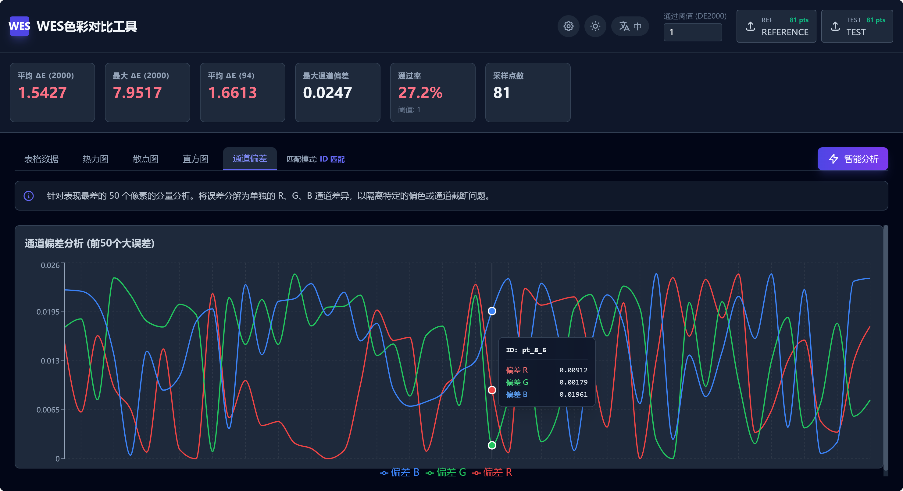

<div align="center">
  
</div>

# WES 色彩对比工具

一个面向图像处理、渲染验收和插件比对场景的色彩分析工具。它通过读取两份像素采样 JSON，自动完成点位匹配、色差计算、统计汇总和可视化展示，帮助用户快速判断“测试结果是否真的和参考结果一致”，并进一步定位偏差集中在哪些区域、哪些通道、哪类颜色区间。

## 产品定位

这个项目解决的不是“看两张图是否大概一样”，而是“用可量化的方法验证两个输出结果在颜色上是否一致”。

在真实的制作链路里，团队经常会遇到这些问题：

- 一个 OpenFX 插件升级后，颜色是否发生了漂移
- 同一套算法在不同宿主软件里输出是否一致
- 代理转码、色彩空间转换、Gamma 处理后是否引入了误差
- 某个版本的渲染结果是否还能满足交付阈值

WES 色彩对比工具就是为这类验收和诊断场景设计的。它把原本分散在表格、脚本、截图比对里的工作收敛成一个统一的分析界面。

## 面向的用户

- 图像算法和图形研发团队：验证版本迭代前后的色彩一致性
- 插件 / 宿主集成团队：比较不同宿主、不同平台、不同接口链路的输出差异
- QA 与技术支持团队：快速复现并解释“颜色不一致”的问题
- 调色、影像和后期管线团队：量化检查参考图与测试图之间的色彩偏差

## 核心使用流程

1. 导入参考 JSON 和测试 JSON
2. 系统自动识别两组数据的匹配方式
3. 按点位计算 ΔE 76、ΔE 94、ΔE 2000 和通道偏差
4. 汇总平均值、最大值、通过率等关键指标
5. 通过表格、热力图、散点图、直方图和通道图定位问题
6. 按需发起 AI 技术分析，生成文字化诊断报告

## 当前版本能力

### 1. 双 JSON 对比分析

- 支持加载两份像素采样 JSON
- 支持从多种字段格式中自动归一化数据
- 支持补全缺失坐标、推断 kernel 布局和像素位置
- 支持 8-bit 与 0-1 浮点色值的自动标准化

### 2. 自动匹配策略

系统会按优先级自动选择最佳匹配方式：

- `ID` 匹配：适合有稳定采样点标识的数据
- 坐标匹配：适合按位置对齐的采样结果
- 顺序匹配：适合像素数量一致、按固定顺序输出的数据

这让它不仅能处理规范化输出，也能兼容一些历史格式或第三方导出结果。

### 3. 色彩误差计算

当前版本内置多种常见指标：

- ΔE 76
- ΔE 94
- ΔE 2000
- 单点最大通道偏差
- 基于阈值的通过率

其中 ΔE 2000 被作为主判断指标，用于统计通过率、热力图颜色映射和主要风险判断。

### 4. 五种分析视图

- 表格视图：查看每个采样点的参考值、测试值和各项误差指标
- 热力图：观察高偏差区域在空间上的分布
- 散点图：检查通道线性关系，发现 Gamma 或非线性响应问题
- 直方图：查看误差整体分布，判断是否集中或分层
- 通道偏差图：拆解高误差点的 R / G / B 偏差来源

### 5. AI 技术诊断

- 支持基于统计结果生成技术分析报告
- 支持 Google Gemini 与 OpenAI 兼容协议
- 支持自定义 Base URL、模型名和 API Key
- 适合把“看图判断”转成“结构化解释”

### 6. 交互体验

- 支持中英文界面切换
- 支持深色 / 浅色主题切换
- 支持阈值手动调整
- 默认内置 mock 数据，方便直接体验界面和流程

## 产品价值

从产品视角看，这个工具的价值主要体现在三个层面：

- 把“主观觉得颜色不对”转化为“可量化的误差判断”
- 把“知道有问题”推进到“知道问题集中在哪里、可能为什么发生”
- 把研发、测试、支持和管线团队对同一问题的理解统一到一套指标和图表上

它不是一个单纯的图表展示工具，而是一个围绕“色彩一致性验收”设计的诊断工作台。

## 适用场景

- OpenFX / GPU 特效插件输出一致性验证
- 渲染链路前后版本对比
- 不同宿主软件之间的结果验收
- 色彩空间转换或 Gamma 变更后的回归测试
- 图像算法迭代后的质量检查
- 与客户或合作方沟通技术差异时提供客观依据

## 当前技术实现

这是一个前端驱动的分析原型，核心实现包括：

- React 19 + TypeScript
- Vite 构建
- Recharts 数据可视化
- 本地 JSON 读取与归一化处理
- CIE Lab 与 Delta E 相关计算
- AI 报告生成接口封装

当前应用的重点是“分析与展示流程完整”，而不是复杂的后端任务系统。

## 当前边界与限制

这个版本已经足够用于演示和内部分析，但距离生产级平台仍有一些边界：

- 当前主要面向 JSON 采样结果，而不是直接上传图像做像素级全图比对
- AI 报告依赖外部模型服务，需要用户自行配置接口
- 没有项目管理、报告归档、多人协作或批量任务队列
- 没有内置行业标准模板，例如不同业务线的阈值规范或验收规则集
- 当前的散点分析以 G 通道为主，更复杂的综合色彩诊断还可以继续扩展

## 后续演进方向

- 支持直接导入图像并自动采样
- 增加批量比对与批次报告输出
- 增加项目级阈值模板和行业标准规则
- 引入更多色彩质量指标和异常分类
- 支持报告导出为 PDF / Markdown / CSV
- 接入云端存储、历史版本对比和团队协作

## 本地运行

### 环境要求

- Node.js

### 启动方式

```bash
npm install
npm run dev
```

### 构建生产包

```bash
npm run build
```

## 仓库结构

```text
Color-Compare/
├── App.tsx                      # 主工作台、状态管理与分析流程
├── components/
│   ├── MetricsBar.tsx           # 指标汇总条
│   ├── Heatmap.tsx              # 热力图视图
│   ├── Charts.tsx               # 散点图、直方图、通道图
│   └── SettingsModal.tsx        # AI 配置面板
├── services/
│   ├── colorMath.ts             # 色彩空间与 Delta E 计算
│   └── gemini.ts                # AI 分析与连接测试
├── types.ts                     # 类型定义
├── metadata.json                # 应用元数据
└── assets/
    └── readme-banner.png        # README 展示图
```

## 一句话总结

WES 色彩对比工具是一个面向色彩一致性验收的分析工作台：用结构化数据完成精确比对，用多视图可视化定位偏差，用 AI 报告辅助解释问题。
